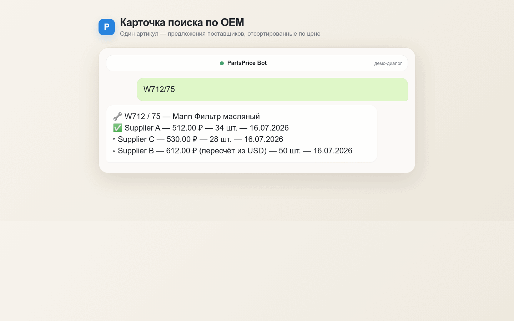
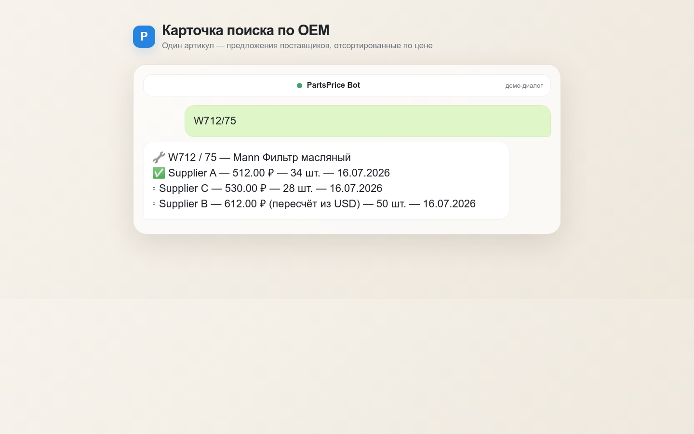
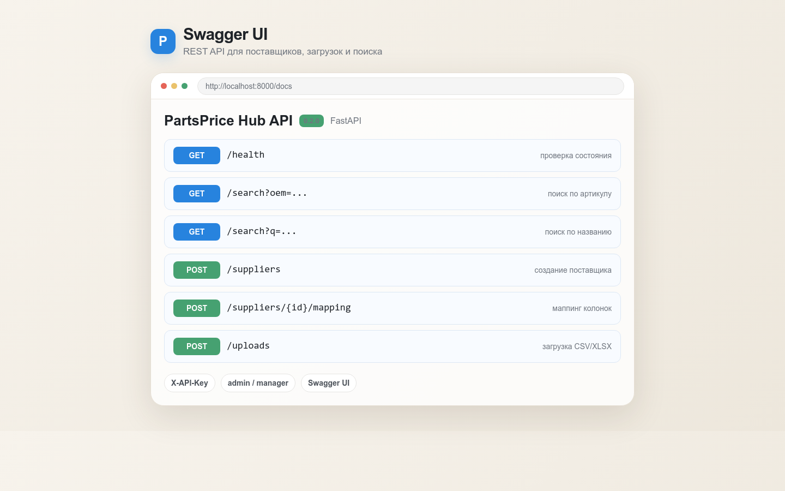
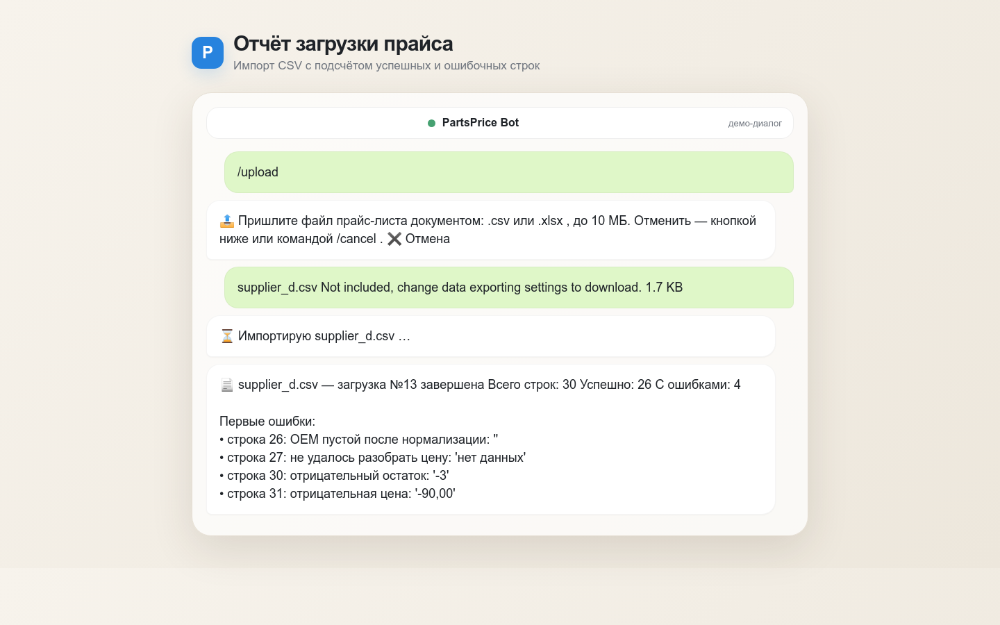

# PartsPrice Hub

**Агрегатор прайс-листов поставщиков автозапчастей: загружает CSV/Excel, приводит артикулы и цены к единому виду и позволяет искать предложения через Telegram-бота и REST API.**



## Проблема и решение

Поставщики присылают прайс-листы в разных форматах: названия колонок не совпадают, OEM-артикулы записаны с пробелами и разделителями, а цены указаны в разных валютах. Из-за этого сравнение предложений вручную занимает время и легко приводит к ошибкам или дублям. PartsPrice Hub хранит маппинг колонок для каждого поставщика, нормализует данные, пересчитывает цены в рубли и сохраняет одно актуальное предложение поставщика на деталь. Результат можно получить через Telegram-бота или REST API, не разбирая исходные файлы вручную.

## Возможности

- импорт прайс-листов в форматах `.csv` и `.xlsx`;
- отдельный маппинг колонок для каждого поставщика;
- автоматическое определение разделителя CSV: `;` или `,`;
- нормализация OEM-артикулов и брендов;
- разбор цен в российских и международных форматах;
- поддержка валют `RUB`, `USD`, `EUR` и `CNY` с пересчётом в рубли;
- кэширование курсов валют в БД и fallback на последний сохранённый курс;
- upsert деталей и предложений без накопления дублей при повторной загрузке;
- отчёт об импорте: всего строк, успешно обработано, отклонено и причины первых ошибок;
- поиск по OEM и подстроке в названии;
- сортировка предложений по цене в рублях;
- Telegram-бот на aiogram 3 с ролями `admin`, `manager` и `pending`;
- REST API на FastAPI с авторизацией по API-ключу и Swagger UI;
- асинхронная работа с БД через SQLAlchemy 2.x;
- миграции схемы через Alembic.

## Скриншоты

### Карточка поиска в Telegram



### Swagger UI

<!-- Добавьте реальный скрин Swagger: docs/images/swagger.png -->


### Отчёт загрузки прайс-листа



## Архитектура

```text
┌────────────────────┐       ┌────────────────────┐
│ Telegram-бот       │       │ REST API / Swagger │
│ aiogram 3          │       │ FastAPI            │
└─────────┬──────────┘       └─────────┬──────────┘
          │                            │
          └─────────────┬──────────────┘
                        ▼
             ┌──────────────────────┐
             │ services             │
             │ normalizer           │
             │ importer             │
             │ currency             │
             │ search               │
             └──────────┬───────────┘
                        ▼
             ┌──────────────────────┐
             │ SQLAlchemy + Alembic │
             │ SQLite / PostgreSQL  │
             └──────────────────────┘
```

Telegram-бот и REST API отвечают только за пользовательский интерфейс, валидацию входных данных и контроль доступа. Бизнес-логика вынесена в `app/services`: одни и те же правила нормализации, импорта, конвертации валют и поиска используются из разных интерфейсов без дублирования кода. Такой подход упрощает тестирование: сервисы можно проверять отдельно от Telegram и HTTP, а интерфейсы — заменять или расширять без переписывания основной логики.

## Быстрый старт через Docker Compose

Понадобятся Docker и Docker Compose.

```bash
# 1. Скачать проект
git clone https://github.com/yatochkaa/PartsPrice.git

# 2. Перейти в каталог
cd PartsPrice

# 3. Создать локальный файл окружения
cp .env.example .env

# 4. Заполнить BOT_TOKEN, API_SECRET и ADMIN_TELEGRAM_ID, затем запустить сервисы
docker compose up --build -d

# 5. Создать схему и загрузить синтетические примеры
docker compose exec api python -m scripts.seed
```

После запуска:

- Swagger UI: `http://localhost:8000/docs`;
- проверка API: `http://localhost:8000/health`;
- логи: `docker compose logs -f api bot`.

> Для REST-запросов к защищённым маршрутам передайте заголовок `X-API-Key`. Для административных операций также используется роль администратора.

## Технические решения

### Нормализация OEM

Перед поиском и сохранением OEM приводится к верхнему регистру, очищается от пробелов, дефисов, точек и слэшей. Визуально похожие кириллические символы заменяются латинскими: например, кириллическая `С` не создаст отдельный артикул рядом с латинской `C`. Исходное значение также сохраняется для отображения и проверки.

### Точные денежные расчёты

Цены и валютные курсы обрабатываются через `Decimal`, а в БД хранятся как `Numeric`. Это исключает типичные ошибки двоичной арифметики `float`; итоговая цена в рублях округляется до копеек по правилу `ROUND_HALF_UP`.

### Fallback курсов валют

Курс запрашивается один раз на файл и кэшируется в БД на 24 часа. Если внешний источник временно недоступен, используется последний сохранённый курс. Если сеть недоступна и в БД ещё нет значения, импорт завершается с понятной ошибкой вместо сохранения цены с неподтверждённым курсом.

### Upsert без дублей

Деталь уникальна по паре `(нормализованный OEM, бренд)`, а предложение — по паре `(деталь, поставщик)`. Повторная загрузка обновляет актуальные цену, остаток и время обновления, а не создаёт новую строку предложения. Дополнительный кэш внутри импорта защищает от дублей в одном файле; если одна позиция встречается несколько раз, применяется последняя корректная строка.

### SQLite → PostgreSQL одной переменной

Код работает через асинхронный SQLAlchemy и получает строку подключения из `DATABASE_URL`. Для локальной разработки можно использовать SQLite:

```env
DATABASE_URL=sqlite+aiosqlite:///./partsprice.db
```

Для PostgreSQL достаточно заменить значение переменной окружения, не меняя бизнес-логику:

```env
DATABASE_URL=postgresql+asyncpg://user:password@db:5432/partsprice
```

## REST API

Основные маршруты:

- `GET /health` — проверка состояния без авторизации;
- `GET /search?oem=...` — поиск по OEM;
- `GET /search?q=...` — поиск по названию;
- `POST /suppliers` — создание поставщика;
- `POST /suppliers/{supplier_id}/mapping` — настройка маппинга колонок;
- `POST /uploads` — загрузка прайс-листа;
- `GET /uploads/{upload_id}` — получение сводки загрузки.

Полное интерактивное описание доступно в Swagger UI по адресу `/docs`.

## Тесты

```bash
pytest -q
```

Тестами покрыты:

- нормализация OEM и брендов;
- разбор цен и остатков, включая ошибочные значения;
- получение, кэширование и fallback валютных курсов;
- чистый импорт и импорт файла с некорректными строками;
- повторный импорт без дублей;
- конвертация валют;
- поиск по OEM и названию;
- авторизация и полный API-сценарий: поставщик → маппинг → загрузка → поиск.

Тесты сервисов используют in-memory SQLite, а внешние курсы подменяются моками, поэтому основной набор не зависит от сети.

## Структура проекта

```text
app/
├── api/          # FastAPI, зависимости, схемы и роутеры
├── bot/          # Telegram-бот, middleware, клавиатуры и handlers
├── core/         # конфигурация и логирование
├── db/           # ORM-модели и асинхронные сессии
└── services/     # нормализация, импорт, валюты и поиск
alembic/          # миграции БД
sample_data/      # синтетические прайс-листы для демонстрации
scripts/          # проверка конфигурации и seed
 tests/           # unit- и интеграционные тесты
```

## Roadmap

- [ ] история изменения цен по поставщикам;
- [ ] фоновая обработка больших прайс-листов с очередью задач;
- [ ] экспорт результатов поиска и отчётов в Excel.

## Дисклеймер

**Учебно-демонстрационный проект, данные синтетические.** Проект не является коммерческим сервисом, а примеры поставщиков, цен и остатков используются только для демонстрации и тестирования.
